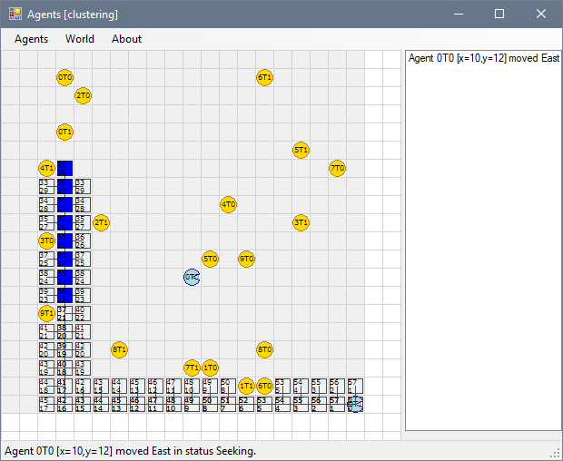

Agent Clustering Simulation
===========================

Bi-dimensional grid simulation in which various agents on a map try to create a cluster a group of elements by putting them together.

Done as a part of a Simulation undergrad Computer Science course in 2014 by **Juan Carlos Pujol Mainegra**. 